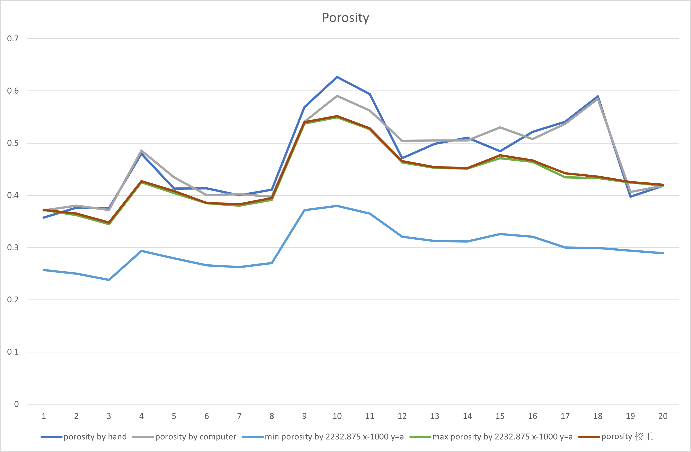

## Identification-of-core-XCT-photographs.md

# Identification-of-core-XCT-photographs

## Intro

For now, due to its convenience and simplicity, I use Python to design the algorithm and find the solution to this program.
What I have done:

1. Read dicom images.
2. Extracte the data in the dicom files, such as pixel, rescale slope and rescale intercept.
3. Use the extracted data to calculate CT value by the formula:
   > Hu = pixel \* rescale slope + rescale intercept
4. Scale the value of pixel data into 0~255, so that we can apply image processing algorithms to this gray image.
5. Now we have two matrices. One is CT value matrix. The other is image matrix.

### Use image processing algorithms to find the target

Now, we use the image matrix.
First, we find the inner circle of the rock container to fliter out the rock container when calculating porosity later.
Then, by findContours algorithm, we know where is the target.
Program flow:

1. make the image blur
2. use Canny algorithms to find the edge of the image
3. find the inner circle of the rock container by Circle Hough Transform
4. Threshold the image to create a binary image
5. apply findContours algorithm.

### Calculate porosity

First of all, use the CT value matrix as reference. If the point in the image matrix is in the circle and the contour of the target, we push the CT value into an array for further calculation. Second, after viewing all point, grab the max value in that array, which is CTG. So, we have CTG and the CT value of the target. Last but not the least, applying the formula (CTG - Hu) / CTG, suming them up and dividing by the number of pixel in the target, we get the porosity of the rock.

1. get CT value of the point inside in circle and contour of the target.
2. get the CTG value
3. apply the formula (CTG - Hu) / CTG
4. sum them up
5. divide by the number of pixel in the target

### Why I use both Circle Hough Transform and findContours algorithm

It's all because we want to remove the CT value of the container.
It will have a big error if we only use findContours algorithm since when we find the contour of the target, we also include the container. To avoid this situation, we filter out most of container by Circle Hough Transform.

### Areas for improvement

1. The efficiency of the whole alogrithm is bad. It take a few second to calculate the porosity of a photo, which I think is unacceptable if we need to calculate all of x-ray image of core sample in the future.
2. There are some errors we can minimize. One is the CT value of outter cover that protect the core sample, in fact, should be cut out. Another is that if we could know how many pixels of the container are, we can completely filter it out by some math formulas.x`

### app:

- testCircle -> calculate the Porosity,
- testCircle_reverseColor -> turn x-ray pictures to 3d along with 3d slider(for building 3d) and blander(for better viewing)

### setting:

- config.json

### module used

### math

- 最大 porosity 是用 F 點算出來的。最小是用 E 點算出來的
  https://www.geogebra.org/calculator/dsfm3pdx

### meeting

python ./GenerateCubesFromLabels.py '../dcmCutCycleOut_copy' 0 300 2  
python ./GenerateCubesFromLabels.py '../dcmCutCycleOut_copy' 0 5000 2
python ./readDicomCntCT_findInnerCircle_findPorosityByVTK.py './dcmCutCycleOut_copy/'
python ./readDicomCntCT_findInnerCircle_findPorosityByVTK.py './dcmCutCycleOut_copy/' --isDraw
python ./readDicom_pickCenter3d.py './bh-3 DICOM-20230421T075124Z-001/bh3 15 dicom_20' --isDraw -outDirname './testDcmOut'
python ./readDicom_pickCenter3d.py './bh-3 DICOM-20230421T075124Z-001/bh3 15 dicom_20' -outDirname './testDcmOut'

## Out Come

## calculate flow

1. CNN is not good.
